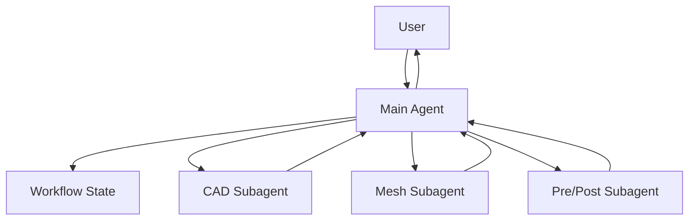
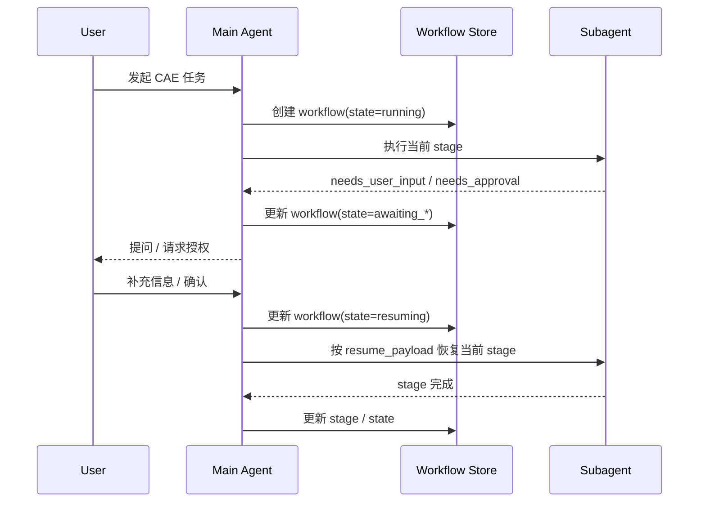

# CAE Agent 当前阶段开发文档

本文档用于落地你当前已经确认的方向：

- `Subagent 可请求 HITL`
- `Main Agent 统一负责 HITL`
- `HITL 需要阻断当前 CAE workflow，直到用户补充信息或授权后再继续`

这不是一份抽象讨论文档，而是一份**当前阶段可直接指导开发的实现文档**。

---

## 1. 当前阶段结论

当前仓库 **不具备** 你需要的这套能力，必须做二次开发。

更准确地说，现有项目已经有一些可复用基础：

- Main Agent 有 `message` 工具，可以主动给用户发消息
- session 有历史、checkpoint、恢复机制
- mid-turn injection 允许用户在当前 turn 运行期间补充消息
- subagent 可以独立执行子任务，并把结果通过 system message 回传给 Main Agent

但它**还没有**下面这些关键能力：

- subagent 向 Main Agent 发起结构化 `needs_user_input` / `needs_approval` 请求
- 当前 workflow 进入显式 `awaiting_user_input` / `awaiting_approval` 阻断态
- 用户回复后按照原 workflow 上下文恢复执行
- Main Agent 把用户补充信息精准路由回对应 stage / 对应 subagent 任务
- 用户授权前禁止 CAE 流程继续向后执行

所以，结论很明确：

**当前阶段建议做“阻断式、主 Agent 代理式 HITL”开发。**

---

## 2. 为什么当前阶段要这样做

你的 CAE 场景有几个非常鲜明的特点：

- `cad`、`mesh`、`preprocess`、`postprocess` 都很复杂
- 每个 skill 都可能反复缺参数、缺文件、缺确认
- 某一步没有完成，后一步继续执行通常没有意义
- 某些动作具备明显的工程风险，必须等用户授权

这决定了你需要的不是：

- “随便问一下用户，系统继续往下跑”

而是：

- “到了关键节点就暂停当前流程，等用户补完后从原位置继续”

这正是**阻断式 HITL**。

但是阻断对象要控制正确：

- 不建议阻断整个 nanobot 进程
- 建议只阻断**当前 session 内的当前 CAE workflow**

也就是：

- 当前 CAE 任务暂停
- 等待用户输入
- 用户补完后恢复
- 其他无关 session 仍可运行

这才是合理设计。

---

## 3. 当前仓库里可以复用的基础能力

### 3.1 Main Agent 已经是唯一用户交互入口

当前 `AgentLoop._register_default_tools()` 会注册：

- `message`
- `spawn`

这说明 Main Agent 当前就承担：

- 对用户发消息
- 派生子任务

的双重职责。

这与我们要做的架构是兼容的，不需要推翻。

### 3.2 Subagent 已经是后台执行单元

`SubagentManager._run_subagent()` 里构建 subagent 工具集时，明确排除了：

- `message`
- `spawn`

也就是说，当前 subagent 的天然定位就是：

- 执行
- 汇报结果

而不是：

- 直接和用户对话
- 自己管理人机交互状态

这也和我们要做的方向一致。

### 3.3 Session / checkpoint / 恢复机制已经存在

当前 `AgentLoop` 和 `SessionManager` 里已经有：

- session 历史落盘
- `runtime_checkpoint`
- `pending_user_turn`
- 未完成 turn 的恢复逻辑

这些机制虽然不是为“正式 workflow 级 HITL”设计的，但它们说明：

- 这个项目已经接受“流程可能中断，之后要恢复”的运行模式

所以我们不是从零开始，而是在已有恢复框架上增加**更明确的 workflow 状态机**。

### 3.4 Mid-turn injection 可以继续保留，但不再承担正式阻断 HITL 的职责

mid-turn injection 适合：

- 用户补充一句话
- agent 正在执行
- 这条补充信息恰好还能赶上当前 turn

但它不适合承担你现在要的强语义能力：

- 等授权再继续
- 等关键参数再继续
- 精准恢复到 CAE workflow 某个 stage

所以当前阶段不应继续依赖 injection 机制去“模拟正式 HITL”，而应该把它降级为补充能力。

---

## 4. 当前阶段的目标边界

当前阶段建议只做下面这套最小闭环，不要一次做太大。

### 4.1 要实现的能力

1. subagent 在执行中发现缺信息或缺授权时，能返回结构化请求
2. Main Agent 能识别这个请求，并把 workflow 标记为阻断态
3. Main Agent 统一向用户发问或请求授权
4. 在用户回复前，当前 workflow 不继续执行
5. 用户回复后，系统能恢复到原 stage 继续执行
6. 如果需要，可以重新启动一个新的 subagent 接着做这一步

### 4.2 当前阶段不建议做的能力

1. subagent 直接拥有 `message` 工具
2. subagent 自己维护独立对话线程
3. 多层级 subagent 递归 HITL
4. 完整通用 BPMN / DAG 工作流引擎
5. 一次性支持非常复杂的表单 UI

这几个方向要么破坏现有边界，要么工程量过大，不适合作为当前阶段目标。

---

## 5. 推荐的目标架构

### 5.1 角色分工

**Main Agent**

- 维护 workflow 总状态
- 负责所有用户交互
- 负责阻断和恢复
- 负责把用户回复路由回正确的 stage

**Subagent**

- 执行单阶段任务
- 在需要人类介入时返回结构化 HITL 请求
- 不直接联系用户

**User**

- 提供缺失信息
- 进行显式确认或授权

### 5.2 架构图



### 5.3 执行语义

核心语义不是：

- “subagent 问了用户一句，然后系统继续跑”

而是：

- “subagent 发现阻塞条件”
- “Main Agent 把当前 workflow 置为等待态”
- “Main Agent 向用户发问”
- “收到用户回复前，不再推进该 workflow”
- “回复到达后，从原 stage 恢复”

---

## 6. 阻断模型应该怎么定义

当前阶段建议把阻断定义为：

**阻断当前 workflow 的推进，而不是阻断整个 agent 进程。**

### 6.1 推荐状态

- `running`
- `awaiting_user_input`
- `awaiting_approval`
- `resuming`
- `completed`
- `failed`
- `cancelled`

### 6.2 状态含义

`running`

- workflow 正常执行

`awaiting_user_input`

- workflow 缺信息，必须等待用户补充

`awaiting_approval`

- workflow 需要用户确认或授权，未授权前不能继续

`resuming`

- 已收到用户回复，正在把信息重新注入 workflow 并恢复执行

`completed`

- workflow 成功结束

`failed`

- workflow 出错，无法继续

`cancelled`

- workflow 被用户或系统取消

---

## 7. 当前阶段推荐的数据结构

当前阶段建议先做**最小结构化协议**，不要一开始追求特别复杂。

### 7.1 subagent 返回 HITL 请求

建议让 subagent 的最终结果可以返回统一 JSON 块，例如：

```json
{
  "status": "needs_user_input",
  "workflow_id": "wf_cae_001",
  "stage": "mesh",
  "question": "请补充网格尺寸和边界层参数。",
  "fields": [
    {
      "name": "element_size",
      "label": "网格尺寸",
      "type": "string",
      "required": true
    },
    {
      "name": "boundary_layer",
      "label": "边界层参数",
      "type": "string",
      "required": false
    }
  ],
  "resume_payload": {
    "subagent_label": "mesh",
    "task_template": "继续执行 mesh stage",
    "context": {
      "geometry_path": "workspace/cad/model.step"
    }
  }
}
```

授权请求可以是：

```json
{
  "status": "needs_approval",
  "workflow_id": "wf_cae_001",
  "stage": "solver",
  "question": "即将启动正式求解，预计耗时 4 小时，是否继续？",
  "approval_type": "run_solver",
  "resume_payload": {
    "subagent_label": "solver",
    "task_template": "继续执行 solver stage"
  }
}
```

### 7.2 Main Agent 持久化的 workflow 状态

当前阶段建议至少记录：

```json
{
  "workflow_id": "wf_cae_001",
  "workflow_type": "cae",
  "state": "awaiting_user_input",
  "current_stage": "mesh",
  "awaiting": {
    "kind": "user_input",
    "question": "请补充网格尺寸和边界层参数。",
    "fields": [
      {"name": "element_size", "required": true},
      {"name": "boundary_layer", "required": false}
    ]
  },
  "resume_payload": {
    "subagent_label": "mesh",
    "task_template": "继续执行 mesh stage",
    "context": {
      "geometry_path": "workspace/cad/model.step"
    }
  },
  "artifacts": {
    "cad_model": "workspace/cad/model.step"
  }
}
```

### 7.3 用户回复后的恢复输入

用户回复被结构化后，建议形成：

```json
{
  "workflow_id": "wf_cae_001",
  "stage": "mesh",
  "user_response": {
    "element_size": "2mm",
    "boundary_layer": "5 layers, growth 1.2"
  }
}
```

---

## 8. 当前阶段推荐的存储方案

这里有两个实现选项。

### 8.1 方案 A：先放进 `session.metadata`

优点：

- 开发快
- 改动小
- 适合先跑通单 workflow 场景

缺点：

- 一个 session 里多个 workflow 会越来越乱
- 不利于后续做独立查询、恢复、审计

适用：

- 当前阶段 PoC 或第一版

建议结构：

- `session.metadata["active_workflow"]`
- `session.metadata["workflow_state"]`
- `session.metadata["awaiting_human_input"]`

### 8.2 方案 B：新增独立 workflow 存储

例如：

- `workspace/workflows/<workflow_id>.json`

优点：

- 状态更清晰
- 后续更容易扩展多 workflow
- 更适合 CAE 这种长链路任务

缺点：

- 需要多写一层 manager

适用：

- 如果你准备把 CAE agent 当成长期方向，我更建议直接做这个方案

**建议结论：**

当前阶段如果你要快速落地，可先做 `session.metadata`。

如果你准备继续做下一阶段的 workflow 编排，我建议**直接做独立 workflow store**，避免很快重构第二次。

---

## 9. 当前阶段的核心时序



---

## 10. 当前阶段推荐的实现方式

### 10.1 不要给 subagent 增加 `message`

这点是当前阶段最重要的边界。

不建议这样做：

- subagent 自己 `message` 用户
- 用户直接回复 subagent
- subagent 自己等待回复

因为这会立刻带来一批复杂度：

- 谁维护唯一会话入口
- 用户回复归属哪个 agent
- 多 subagent 同时追问如何冲突消解
- session 历史怎么归档
- 权限和审计归谁负责

当前阶段没必要引入这些问题。

### 10.2 推荐做“结构化结果 + Main Agent 代理”

建议路线：

1. subagent 返回结构化结果
2. Main Agent 解析结果
3. 如果结果是 `needs_user_input` / `needs_approval`，则把 workflow 置为等待态
4. Main Agent 通过 `message` 工具统一向用户发问
5. 当前 workflow 暂停
6. 用户回复后 Main Agent 恢复

---

## 11. 需要改动的模块建议

下面是当前阶段建议的改动落点。

### 11.1 `nanobot/agent/subagent.py`

建议新增或修改：

- 定义 subagent 结果协议
- 支持识别“这是正常完成”还是“这是 HITL 请求”
- 让 `_announce_result()` 能把结构化结果带回 Main Agent

建议不要只传自由文本，最好带一个可解析字段，例如：

- `status=ok`
- `status=needs_user_input`
- `status=needs_approval`
- `status=error`

### 11.2 `nanobot/templates/agent/subagent_announce.md`

建议修改成支持结构化块输出，方便 Main Agent 解析。

例如可以在模板中保留一段 JSON fenced block，或者干脆让 system message 附带 metadata。

### 11.3 `nanobot/agent/loop.py`

这是当前阶段最核心的改动点。

建议新增能力：

- 识别 subagent 回传的 HITL 结构化结果
- 创建或更新 workflow 状态
- 在等待态时，不再继续推进该 workflow
- 收到用户后续消息时，优先判断是否是对等待态 workflow 的回复
- 将回复结构化后写回 workflow，并进入 `resuming`
- 用 `resume_payload` 恢复当前 stage

这里最关键的不是“能不能问用户”，而是：

- **能不能在用户回复前阻断当前 workflow**
- **能不能在用户回复后回到原 stage**

### 11.4 `nanobot/session/manager.py`

如果你先走 `session.metadata` 方案，这里主要是：

- 定义 metadata 结构
- 保证 workflow 状态能稳定持久化

如果你走独立 workflow store，则这个文件改动会少一些。

### 11.5 新增 `workflow` 层模块

如果你愿意把这事做得更干净，建议新增：

- `nanobot/workflow/schema.py`
- `nanobot/workflow/store.py`
- `nanobot/workflow/manager.py`

职责建议如下：

`schema.py`

- 定义 workflow state、stage、awaiting request、resume payload

`store.py`

- 读写 workflow 持久化文件

`manager.py`

- 创建 workflow
- 更新状态
- 判断是否等待用户输入
- 消费用户回复并生成 resume command

对 CAE 这种长链路任务，这层值得加。

---

## 12. 建议新增的内部协议

### 12.1 `SubagentOutcome`

建议定义统一结果对象：

```python
{
  "status": "ok | needs_user_input | needs_approval | error",
  "workflow_id": "...",
  "stage": "...",
  "message": "...",
  "payload": {...}
}
```

### 12.2 `HumanRequest`

```python
{
  "kind": "user_input | approval",
  "question": "...",
  "fields": [...],
  "approval_type": "...",
  "blocking": true
}
```

### 12.3 `ResumePayload`

```python
{
  "subagent_label": "mesh",
  "task_template": "继续执行 mesh stage",
  "context": {...}
}
```

---

## 13. 用户回复如何恢复

这部分是当前阶段最容易被低估的点。

你真正要实现的不是：

- “用户发来一句话，Main Agent 又开始新聊天”

而是：

- “用户发来一句话，系统识别到这是一条对挂起 workflow 的回复”
- “系统把这条回复注入到对应 workflow”
- “系统恢复原来的 stage”

### 13.1 推荐处理逻辑

收到用户新消息时：

1. 先检查当前 session 是否存在 `awaiting_user_input` / `awaiting_approval` 的 workflow
2. 如果没有，则按普通消息处理
3. 如果有，则把用户消息当成恢复输入处理
4. 更新 workflow 为 `resuming`
5. 基于 `resume_payload` 重新组织 subagent 任务
6. 重新进入执行

### 13.2 对授权类回复的建议

授权类建议不要依赖自由文本理解得太激进。

当前阶段建议至少支持：

- `确认`
- `继续`
- `同意`
- `取消`

如果后续接渠道 UI，再升级成按钮式确认会更稳。

---

## 14. 当前阶段的最小实现路线

建议分 4 步做。

### 第一步：先打通结构化 subagent 结果

目标：

- subagent 能返回 `ok / needs_user_input / needs_approval / error`
- Main Agent 能识别这些结果

验收：

- 手工构造一个 mesh subagent，能正确触发“缺参数”返回

### 第二步：加入 workflow 等待态

目标：

- Main Agent 收到 `needs_user_input` 后更新 workflow 状态
- 向用户发问
- 不再继续推进当前 workflow

验收：

- mesh 阶段缺参数时，系统确实停住，不会继续到后处理

### 第三步：加入用户回复恢复

目标：

- 用户补充参数后，系统能恢复到原 stage

验收：

- 用户回复网格尺寸后，mesh stage 继续跑，而不是重新从 CAD 起步

### 第四步：加入 approval gate

目标：

- 某些高成本动作必须显式确认

验收：

- 求解或批量脚本执行前，未确认不继续；确认后恢复执行

---

## 15. 当前阶段推荐的 CAE stage 划分

你现在的场景下，建议至少先把 workflow stage 明确定义出来。

例如：

- `cad`
- `mesh`
- `preprocess`
- `solve`
- `postprocess`

每个 stage 都应具备：

- 输入要求
- 产物定义
- 失败条件
- 可能触发的 HITL 类型

例如：

`cad`

- 可能缺几何文件
- 可能缺建模意图

`mesh`

- 可能缺网格尺寸
- 可能缺局部加密区域定义

`preprocess`

- 可能缺材料参数
- 可能缺边界条件

`solve`

- 可能需要执行前确认
- 可能需要资源预算确认

`postprocess`

- 可能缺评价指标
- 可能缺输出格式要求

---

## 16. 当前阶段的风险点

### 16.1 不要把自由文本解析当成正式协议

如果 subagent 回传：

- “我感觉还需要用户补充一点信息”

这种自由文本太脆弱。

当前阶段一定要尽早转成结构化协议。

### 16.2 不要让等待态只存在模型上下文里

如果 workflow 的等待状态只靠 prompt 和记忆维持，重启或异常后会丢失。

必须持久化。

### 16.3 不要让恢复逻辑退化成“重来一遍”

如果每次用户补充后都从 `cad` 重新开始，实际可用性会很差。

至少要恢复到当前 stage。

### 16.4 不要阻断整个系统

这会把一个 CAE session 的等待扩散成全局可用性问题。

当前阶段必须坚持：

- 阻断的是 workflow
- 不是整个 agent runtime

---

## 17. 当前阶段建议的验收标准

当下面 6 条都成立时，当前阶段可以认为基本完成：

1. `mesh` subagent 能主动返回 `needs_user_input`
2. Main Agent 能向用户准确发问
3. 当前 workflow 在用户回复前不会继续推进
4. 用户回复后能恢复到 `mesh` stage
5. `solve` 阶段能触发 `needs_approval`
6. 未授权前不会执行求解，授权后能继续

---

## 18. 当前阶段推荐的最终设计结论

对于你现在要做的 CAE agent，最合适的当前阶段方案不是：

- 给 subagent 一个完全独立的人机交互能力

而是：

- **让 subagent 成为“可请求人类介入的执行单元”**
- **让 Main Agent 成为“统一的人类交互和 workflow 控制器”**
- **让 workflow 具备正式的阻断和恢复语义**

一句话总结：

**当前阶段最值得做的不是“Subagent 独立 HITL”，而是“阻断式、可恢复、Main-Agent-代理式 HITL workflow”。**

---

## 19. 当前阶段建议的下一步

如果你准备继续实现，建议开发顺序就是：

1. 先定义 workflow / human-request / resume-payload 数据结构
2. 再改 `subagent.py` 和 `subagent_announce.md`，让 subagent 能回传结构化 HITL 请求
3. 再改 `agent/loop.py`，做等待态、阻断和恢复
4. 最后再把 `cad` / `mesh` / `preprocess` / `postprocess` skill 接进来

如果你要我继续往下推进，下一步最合适的是直接补第二份文档：

- `接口与数据结构设计文档`

或者直接进入代码设计：

- workflow schema
- store
- Main Agent 恢复逻辑
- subagent 结果协议
