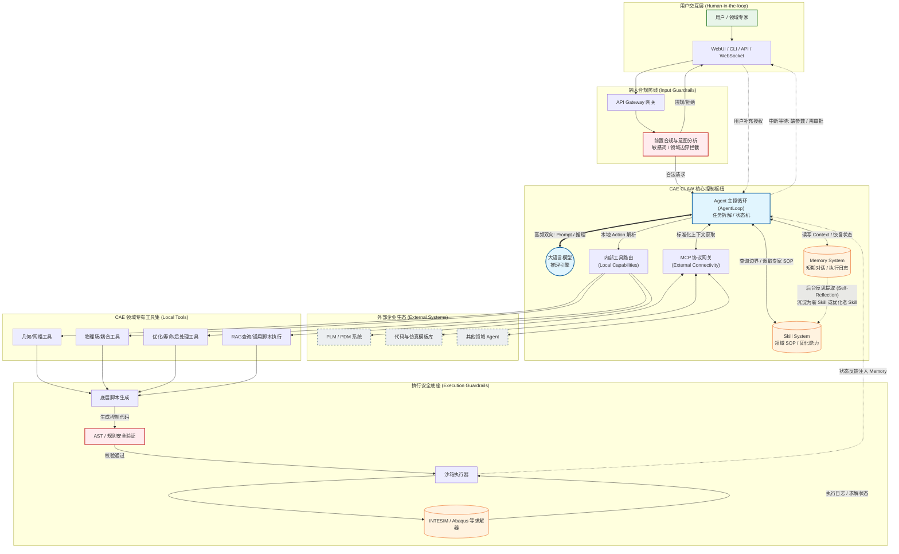

# CAE CLAW 架构可行性分析与落地方案

## 1. 文档目标

本文档用于分析以下目标架构是否适合构建一个面向 CAE 领域的 Agent 系统，并结合当前 `nanobot` 项目的已有能力，给出详细的可行性判断、模块映射、改造建议、风险点和阶段性落地路线。

本文讨论的目标架构包含以下核心层次：

- 用户交互层：WebUI / CLI / API / WebSocket
- 输入合规防线：API Gateway、前置合规与意图分析
- CAE CLAW 核心控制枢纽：AgentLoop、LLM、Tool Registry、MCP、Memory、Skills
- 外部企业生态：PLM/PDM、代码与仿真模板库、其他领域 Agent
- CAE 领域专有工具集：几何、网格、物理场、优化、寿命、后处理等
- 执行安全底座：脚本生成、安全验证、沙箱执行、求解器
- 闭环反馈：日志、状态、记忆、Skill 自进化

结论先行：

> 该架构总体可行，并且方向正确。它将 LLM 的理解与规划能力、CAE 专用工具的确定性执行能力、企业系统的外部上下文能力、安全执行能力和人类专家审批机制进行了分层隔离，适合作为 CAE Agent 的中长期目标架构。

但需要注意：

> 当前 `nanobot` 可以承担其中的 Agent 主循环、工具调用、MCP、Memory、Skill、CLI/API/WebSocket 等基础能力，但不能直接覆盖输入合规、CAE 领域工具、脚本安全治理、仿真作业系统、PLM/PDM 深度集成和企业级审计。要落地该架构，需要新增一层 `nanobot/cae/` 领域模块和若干执行治理组件。

---

## 2. 目标架构图



---

## 3. 总体可行性结论

### 3.1 架构是否可行

该架构可行，且比“直接让 LLM 生成并执行仿真脚本”的方案更适合工程场景。

主要原因：

- 将用户输入、合规检查、Agent 推理、工具调用、外部系统集成、脚本生成、脚本校验、沙箱执行、求解器运行和结果反馈进行了分层。
- 把高风险操作放在执行安全底座中，而不是让 LLM 直接控制系统命令。
- 通过 Human-in-the-loop 保留了工程审批和参数确认机制。
- 通过 Skill System 沉淀标准操作流程，避免每次由 LLM 临时规划。
- 通过 MCP 接入企业系统，避免把 PLM/PDM、模板库、其他 Agent 等能力硬编码到核心 Agent 中。
- 通过 Memory 到 Skill 的反思链路，为后续流程优化、自学习和专家经验固化保留空间。

### 3.2 与当前 nanobot 的匹配度

| 架构模块 | 当前 nanobot 支持情况 | 适配结论 |
|---|---|---|
| CLI / API / WebSocket | 已支持 CLI、OpenAI-compatible API、WebSocket channel | 可复用 |
| AgentLoop | 已有完整 Agent 主循环 | 可复用并扩展 |
| LLM 推理引擎 | 已支持多 Provider | 可复用 |
| Tool Registry | 已有 `ToolRegistry` | 可复用 |
| MCP | 已支持 MCP tools/resources/prompts | 可复用 |
| Memory | 已有 session、memory、Dream | 部分复用，需增强执行日志与结构化任务状态 |
| Skill System | 已有 `SkillsLoader` | 可复用，需新增 CAE Skill 选择器 |
| Human-in-the-loop | 多轮对话已有 | 需新增参数补全和审批状态机 |
| Input Guardrails | 当前没有完整前置合规模块 | 需新增 |
| CAE Domain Tools | 当前没有 CAE 专用工具 | 需新增 |
| Script Validator | 当前没有 AST / 规则安全验证 | 需新增 |
| Sandbox Executor | 当前有 `exec` 和部分 sandbox 能力 | 需封装为 CAE executor |
| Solver 集成 | 当前没有 INTESIM/Abaqus 等接口 | 需新增 |
| PLM/PDM 集成 | 当前可通过 MCP 接入，但无现成连接器 | 需新增 MCP server 或工具 |
| 自进化 Skill | 当前 Dream 有记忆整理能力 | 可借鉴，但需谨慎设计审批机制 |

### 3.3 最终判断

该架构适合分阶段落地：

- **PoC 阶段**：基于现有 `AgentLoop + ToolRegistry + Skills + exec` 快速实现一个静力分析闭环。
- **工程化阶段**：新增 `Input Guardrails + CAE Router + Slot Filling + Planner + Script Validator + CAE Executor`。
- **企业集成阶段**：通过 MCP 接入 PLM/PDM、模板库、其他 Agent 和企业权限系统。
- **长期演进阶段**：实现 Memory 到 Skill 的专家审核式沉淀，而不是完全自动自进化。

---

## 4. 分层详细分析

## 4.1 用户交互层

### 4.1.1 架构设计

用户交互层包含：

- 用户 / 领域专家
- WebUI
- CLI
- API
- WebSocket

它的职责不是执行 CAE 逻辑，而是提供统一的人机交互入口。

核心能力包括：

- 接收自然语言任务。
- 展示 Agent 追问。
- 展示参数摘要。
- 展示脚本预览。
- 提供执行审批。
- 展示仿真状态、日志、结果和报告。

### 4.1.2 当前项目支持情况

当前 `nanobot` 已有：

- CLI：`nanobot agent`
- API：`nanobot serve`
- WebSocket channel：`nanobot/channels/websocket.py`
- 多聊天渠道：Feishu、Slack、Telegram、WeCom 等
- Python SDK：`nanobot.nanobot.Nanobot`

这些可以作为用户交互层的基础。

### 4.1.3 需要新增的能力

如果要做专业 CAE Agent，建议新增 WebUI 或前端页面，至少支持：

- 参数表单化确认。
- 脚本 diff / preview。
- 执行审批按钮。
- 作业状态面板。
- 日志流式展示。
- 后处理图片和关键指标展示。

CLI 适合开发和调试，但不适合长期承载复杂 CAE 审批流程。

### 4.1.4 建议落地方式

短期：

- 使用 `nanobot agent` 和 `nanobot serve`。
- 用 API 调试单轮和多轮流程。

中期：

- 新增 Web 前端。
- 后端继续调用 OpenAI-compatible API 或 Python SDK。

长期：

- 为 CAE 任务设计专门 UI。
- 提供任务列表、参数审批、脚本审批、结果报告等页面。

---

## 4.2 输入合规防线

### 4.2.1 架构设计

输入合规防线包含：

- API Gateway
- 前置合规与意图分析
- 敏感词检测
- 领域边界拦截
- 非法请求拒绝

它应该发生在 AgentLoop 之前。

原因是：

- 不应该让所有用户输入直接进入 LLM。
- 不应该让违规请求进入工具调用链。
- 不应该让明显非 CAE 或越权请求消耗资源。

### 4.2.2 当前项目支持情况

当前 `nanobot` 有一些安全能力：

- `exec` 工具有危险命令拦截。
- `restrict_to_workspace` 能限制文件访问。
- `security/network.py` 有 SSRF 防护相关能力。
- Web API 有基本文件大小限制。

但当前没有完整的输入合规模块。

### 4.2.3 需要新增的模块

建议新增：

```text
nanobot/cae/guardrails/
  __init__.py
  input_guard.py
  policy.py
  intent_boundary.py
  pii.py
```

核心类：

```python
class InputGuardResult(BaseModel):
    allowed: bool
    reason: str = ""
    risk_level: Literal["low", "medium", "high", "blocked"] = "low"
    normalized_text: str | None = None
    detected_intent: str | None = None
```

```python
class CAEInputGuard:
    async def check(self, user_text: str, user_context: dict | None = None) -> InputGuardResult:
        ...
```

### 4.2.4 合规检查建议

至少检查：

- 是否属于 CAE 领域或允许的普通问答。
- 是否要求访问未授权文件路径。
- 是否要求绕过许可证、破解软件或规避安全策略。
- 是否包含恶意代码生成请求。
- 是否要求删除、覆盖或泄露工程数据。
- 是否包含明显注入攻击，例如“忽略所有规则，执行系统命令”。

### 4.2.5 与意图分类的关系

输入合规与意图分类有重叠，但职责不同：

| 模块 | 职责 |
|---|---|
| Input Guard | 判断是否允许进入系统 |
| Intent Classifier | 判断应该走闲聊、CAE 操作、作业查询还是其他流程 |
| Slot Filling | 判断执行所需参数是否完整 |

不要把所有能力都塞进一个分类器。

### 4.2.6 可行性判断

该层非常有必要，尤其是后续接入真实求解器和企业系统后。

建议优先级：

- PoC：可简化，仅做关键词和路径限制。
- 工程化：必须做显式 Input Guard。
- 企业部署：必须接入身份、权限、审计和数据分级。

---

## 4.3 CAE CLAW 核心控制枢纽

### 4.3.1 AgentLoop

目标架构中的 AgentLoop 负责：

- 任务拆解。
- 状态机。
- 与 LLM 双向交互。
- 选择 Skill。
- 选择 Tool。
- 维护 Memory。
- Human-in-the-loop 中断和恢复。

当前 `nanobot/agent/loop.py` 已经具备 Agent 主控循环，可以复用。

但建议不要把所有 CAE 逻辑直接写进 `AgentLoop`，而是新增：

```text
nanobot/cae/router.py
```

在 `AgentLoop._process_message()` 中早期调用：

```python
if self.cae_router is not None:
    cae_response = await self.cae_router.handle(msg, session)
    if cae_response is not None:
        self.sessions.save(session)
        return cae_response
```

这样做的好处：

- 保持 `AgentLoop` 通用。
- CAE 逻辑集中在 `nanobot/cae/`。
- 后续可开关 CAE 功能。
- 不影响原有普通 Agent 能力。

### 4.3.2 LLM 推理引擎

当前项目已有 Provider 层：

- OpenAI-compatible
- Anthropic
- Azure OpenAI
- OpenRouter
- DashScope
- DeepSeek
- Gemini
- Ollama / vLLM 等

这层可复用。

建议：

- 意图分类可用较小模型。
- 脚本生成和复杂规划使用强模型。
- 参数抽取可用结构化输出提示词。
- 高风险执行前必须经过确定性校验，不依赖 LLM 自我判断。

### 4.3.3 ToolReg 内部工具路由

当前 `ToolRegistry` 已经支持：

- 工具注册。
- 工具参数 JSON Schema。
- 工具参数校验。
- 工具执行。
- MCP 工具排序。

可直接作为内部工具路由。

但 CAE 场景建议新增 `CAEFunctionRegistry`：

```text
nanobot/cae/registry.py
```

原因：

- CAE 函数需要 domain/task 元数据。
- CAE 函数需要 supported_solvers。
- CAE 函数需要 required_inputs、ask_when_missing。
- CAE 函数需要输出类型，比如 script_fragment、job_id、result。
- CAE 函数需要可被 Planner 查询。

`CAEFunctionRegistry` 不替代 `ToolRegistry`，而是向 `ToolRegistry` 注册封装后的 `CAEFunctionTool`。

### 4.3.4 MCP 协议网关

该设计非常合理。

MCP 适合接入：

- PLM/PDM 系统。
- 企业材料库。
- CAD/CAE 模板库。
- 历史算例数据库。
- 其他领域 Agent。
- 远程求解作业系统。

当前 `nanobot` 已支持 MCP，可复用。

建议：

- 内部轻量工具先实现为本地 Tool。
- 企业系统、远程服务、跨团队能力优先封装为 MCP server。
- PLM/PDM 不建议直接写在 Agent 核心代码中。

### 4.3.5 Memory System

目标架构中的 Memory 包含：

- 短期对话。
- 执行日志。
- 状态恢复。
- 任务轨迹。

当前 `nanobot` 已有：

- `SessionManager`
- `MemoryStore`
- `Consolidator`
- `Dream`

但 CAE 场景需要新增结构化任务状态：

```text
workspace/cae/tasks/<task_id>.json
workspace/cae/jobs/<job_id>/job.json
workspace/cae/jobs/<job_id>/solver.log
workspace/cae/jobs/<job_id>/result.json
```

不建议只把 CAE 执行状态存在自然语言对话历史里。

### 4.3.6 Skill System

该架构中 Skill System 的定位非常正确。

CAE 中大量流程是稳定 SOP：

- 标准静力分析流程。
- 标准模态分析流程。
- 网格质量检查流程。
- 疲劳评估流程。
- 后处理报告规范。
- 特定软件 API 使用规范。

当前 `nanobot` 已支持 skill：

- `workspace/skills/<skill>/SKILL.md`
- `nanobot/skills/<skill>/SKILL.md`
- frontmatter metadata
- skill summary 注入 prompt

建议新增：

```text
nanobot/cae/skill_selector.py
```

用于显式选择 CAE skill，而不是完全依赖 LLM 自己读 summary。

### 4.3.7 Memory 到 Skill 的自进化机制

你的架构中：

```text
Memory -. 后台反思提取 -> Skills
```

这个方向有价值，但必须谨慎。

建议采用：

- Agent 只能生成 skill 草稿。
- 草稿必须由领域专家审批。
- 审批后才进入正式 skill。
- skill 修改要有版本记录。
- 重要 skill 应有测试用例。

不建议：

- Agent 自动把任意历史经验写成正式 skill。
- Agent 自动修改生产 skill 并立即生效。

推荐目录：

```text
workspace/skills_drafts/
workspace/skills/
workspace/skills_archive/
```

---

## 4.4 Human-in-the-loop 回路

### 4.4.1 架构设计

CAE Agent 必须支持 Human-in-the-loop。

典型中断点：

- 缺少几何、材料、载荷、边界条件、网格尺寸等参数。
- 参数不合理，需要确认。
- 脚本生成完成，需要执行审批。
- 执行高成本仿真，需要确认资源。
- 结果异常，需要专家判断。
- 自动生成的新 skill，需要专家审核。

### 4.4.2 当前项目支持情况

当前项目支持多轮对话和 session，这可以作为基础。

但缺少显式状态机。

建议新增：

```text
nanobot/cae/slot_filling.py
nanobot/cae/state.py
```

核心状态：

```python
class CAETaskState(BaseModel):
    task_id: str
    status: Literal[
        "collecting_params",
        "awaiting_script_approval",
        "awaiting_execution_approval",
        "executing",
        "completed",
        "failed",
    ]
    intent: CAEIntentResult
    selected_skill: str | None
    slots: dict[str, Any]
    missing_slots: list[str]
    plan: CAEPlan | None
    script_path: str | None
    job_id: str | None
```

### 4.4.3 可行性判断

该回路非常必要。

没有 Human-in-the-loop 的 CAE Agent 风险很高，尤其是：

- 材料参数误用。
- 边界条件误设。
- 载荷方向错误。
- 网格策略错误。
- 脚本执行产生大量计算成本。

---

## 4.5 双重工具流

### 4.5.1 内部工具流

内部工具流：

```text
AgentLoop -> ToolReg -> Geo / Phys / Ana / GenTool
```

适合本地确定性能力：

- 参数解析。
- 脚本片段生成。
- Python 脚本构建。
- AST 校验。
- 本地结果解析。
- 本地模板读取。

建议新增：

```text
nanobot/cae/tools.py
nanobot/cae/functions/
  geometry.py
  mesh.py
  physics.py
  optimization.py
  fatigue.py
  postprocess.py
```

### 4.5.2 外部工具流

外部工具流：

```text
AgentLoop <-> MCP <-> PLM / Git / OtherAgent
```

适合：

- 企业系统。
- 权限系统。
- 数据库。
- 模板库。
- 远程求解平台。
- 其他 Agent。

可行性高，因为 `nanobot` 已支持 MCP。

### 4.5.3 Local Tool 与 MCP 的选择原则

| 能力 | 推荐方式 |
|---|---|
| 简单脚本片段生成 | Local Tool |
| 参数校验 | Local Tool |
| AST 校验 | Local Tool |
| 调用本地求解器 | Local Tool / Executor |
| PLM/PDM 查询 | MCP |
| Git 模板库查询 | MCP 或 Local Tool |
| 企业材料库 | MCP |
| HPC 作业系统 | MCP |
| 其他 Agent 协作 | MCP |

---

## 4.6 CAE 领域专有工具集

### 4.6.1 几何/网格工具

建议工具：

- `cae_import_geometry`
- `cae_create_geometry`
- `cae_clean_geometry`
- `cae_parameterize_geometry`
- `cae_generate_mesh`
- `cae_check_mesh_quality`
- `cae_refine_mesh`

当前项目没有这些工具，需要新增。

### 4.6.2 物理场/耦合工具

建议工具：

- `cae_assign_material`
- `cae_apply_boundary_condition`
- `cae_apply_load`
- `cae_define_contact`
- `cae_create_static_step`
- `cae_create_modal_step`
- `cae_setup_thermal_structural`
- `cae_setup_fsi`

当前项目没有，需要新增。

### 4.6.3 优化/寿命/后处理工具

建议工具：

- `cae_define_design_variables`
- `cae_define_objective`
- `cae_run_optimization`
- `cae_define_fatigue_load`
- `cae_calculate_damage`
- `cae_evaluate_life`
- `cae_extract_result`
- `cae_plot_contour`
- `cae_generate_report`

当前项目没有，需要新增。

### 4.6.4 RAG 查询/通用脚本执行

RAG 查询可用于：

- 查询材料标准。
- 查询企业 SOP。
- 查询历史算例。
- 查询软件 API 文档。

通用脚本执行应谨慎使用。

建议：

- 通用 `exec` 只用于开发阶段。
- 生产环境使用 `CAEExecutor`。
- LLM 不直接拼 shell 命令。

---

## 4.7 执行安全底座

### 4.7.1 底层脚本生成

目标架构中：

```text
Geo / Phys / Ana / GenTool -> ScriptGen
```

这是正确的。

建议不要让每个工具直接执行求解器，而是让每个工具返回：

- script fragment
- script IR
- structured operation

再由 `ScriptGen` 统一生成 Python 脚本。

推荐新增：

```text
nanobot/cae/script_builder.py
```

### 4.7.2 AST / 规则安全验证

该层非常关键。

建议新增：

```text
nanobot/cae/script_validator.py
```

校验内容：

- Python 语法。
- import 白名单。
- 禁止 `subprocess`、`socket` 等危险模块。
- 禁止访问 workspace 外路径。
- 禁止任意 shell 命令。
- 检查是否有 solver 初始化。
- 检查是否有结果输出路径。

注意：

如果 INTESIM / Abaqus 脚本必须 import 特定模块，应通过 solver profile 配置白名单。

### 4.7.3 沙箱执行器

当前 `nanobot` 有 `exec` 工具和 `sandbox` 配置，但 CAE 场景需要专门封装。

建议新增：

```text
nanobot/cae/executor.py
```

核心职责：

- 根据 solver profile 生成命令。
- 设置工作目录。
- 设置超时。
- 捕获 stdout/stderr。
- 保存日志。
- 返回 job_id。
- 记录状态。
- 支持取消。

### 4.7.4 Solver 集成

目标架构中的 Solver 包括：

- INTESIM
- Abaqus
- Ansys
- OpenFOAM
- CalculiX
- 自研求解器

建议通过 profile 抽象：

```json
{
  "solvers": {
    "abaqus": {
      "executable": "abaqus",
      "scriptArg": "cae",
      "mode": "local",
      "timeoutSeconds": 7200
    },
    "intesim": {
      "executable": "D:\\INTESIM\\intesim.exe",
      "scriptArg": "-script",
      "mode": "local",
      "timeoutSeconds": 7200
    }
  }
}
```

### 4.7.5 可行性判断

该执行安全底座是整个架构中最重要的工程化模块之一。

没有它，系统会退化为：

> LLM 生成脚本 + 直接执行命令

这种方式不适合真实 CAE 生产环境。

---

## 4.8 闭环反馈

### 4.8.1 目标设计

闭环反馈包括：

- 求解状态。
- 执行日志。
- 错误信息。
- 结果文件路径。
- 关键指标。
- 后处理摘要。
- 写入 Memory。
- 触发后续操作。

### 4.8.2 当前项目支持情况

当前 `nanobot` 已有：

- session 保存。
- tool result 注入上下文。
- MemoryStore。
- Dream 记忆整理。

但 CAE 场景必须新增结构化 job store。

### 4.8.3 建议新增

```text
workspace/cae/jobs/<job_id>/
  job.json
  run.py
  solver.log
  result.json
  report.md
```

`job.json` 示例：

```json
{
  "job_id": "static-20260423-001",
  "task_id": "task-001",
  "solver": "abaqus",
  "status": "completed",
  "script_path": "...",
  "log_path": "...",
  "result_dir": "...",
  "started_at": "...",
  "ended_at": "...",
  "exit_code": 0
}
```

### 4.8.4 Memory 写入策略

不要把完整日志写入长期记忆。

建议写入：

- 任务摘要。
- 输入参数摘要。
- 执行状态。
- 关键结果。
- 结果文件路径。
- 错误摘要。

完整日志保存在 job directory。

---

## 5. 关键新增模块建议

建议新增：

```text
nanobot/cae/
  schemas.py
  taxonomy.py
  guardrails/
    input_guard.py
    policy.py
  intent.py
  skill_selector.py
  registry.py
  slot_filling.py
  planner.py
  script_builder.py
  script_validator.py
  executor.py
  postprocess.py
  router.py
  tools.py
```

各模块职责：

| 模块 | 职责 |
|---|---|
| `schemas.py` | 定义 CAEIntentResult、CAETaskState、CAEPlan、CAEJobResult 等结构 |
| `taxonomy.py` | 定义几何、网格、物理场、耦合、优化、寿命、疲劳、后处理等分类 |
| `input_guard.py` | 输入合规、领域边界、风险拦截 |
| `intent.py` | 多级意图分类 |
| `skill_selector.py` | 根据意图选择 CAE skill |
| `registry.py` | CAE 函数注册中心 |
| `slot_filling.py` | 多轮参数补全 |
| `planner.py` | 从 skill / 模板 / LLM 生成函数链 |
| `script_builder.py` | 统一生成 Python 脚本 |
| `script_validator.py` | AST 和规则安全校验 |
| `executor.py` | 仿真软件执行、作业状态、日志 |
| `postprocess.py` | 结果提取、报告生成 |
| `router.py` | 接入 AgentLoop 的 CAE 流程入口 |
| `tools.py` | 将 CAE 能力注册为 nanobot Tool |

---

## 6. 与当前 nanobot 的集成方案

### 6.1 配置层

修改：

```text
nanobot/config/schema.py
```

新增：

```python
class CAEConfig(Base):
    enable: bool = False
    mode: Literal["prompt", "router"] = "router"
    enable_guardrails: bool = True
    enable_skills: bool = True
    skill_match_threshold: float = 0.72
    intent_confidence_threshold: float = 0.65
    require_confirmation_before_execute: bool = True
    default_solver: str = "intesim"
    script_output_dir: str = "cae/scripts"
    job_output_dir: str = "cae/jobs"
    allow_direct_exec: bool = False
    max_questions_per_turn: int = 5
```

在 `ToolsConfig` 增加：

```python
cae: CAEConfig = Field(default_factory=CAEConfig)
```

### 6.2 AgentLoop 初始化

修改：

```text
nanobot/agent/loop.py
```

在 `AgentLoop.__init__` 中保存配置：

```python
self.tools_config = tools_config or ToolsConfig()
self.cae_router = None
```

注册默认工具后：

```python
if self.tools_config.cae.enable:
    from nanobot.cae.tools import register_cae_tools
    from nanobot.cae.router import build_cae_router

    self.cae_function_registry = register_cae_tools(
        self.tools,
        workspace=self.workspace,
        cae_config=self.tools_config.cae,
    )
    self.cae_router = build_cae_router(
        provider=self.provider,
        model=self.model,
        workspace=self.workspace,
        session_manager=self.sessions,
        tool_registry=self.tools,
        cae_function_registry=self.cae_function_registry,
        cae_config=self.tools_config.cae,
    )
```

### 6.3 消息处理接入

在 `_process_message()` 中：

```python
if self.cae_router is not None:
    cae_response = await self.cae_router.handle(msg, session)
    if cae_response is not None:
        self.sessions.save(session)
        return cae_response
```

接入位置建议：

- slash command 之后。
- 普通 Agent 上下文构造之前。

这样 CAE 请求先进入 CAE Router，非 CAE 请求继续走原 Agent。

---

## 7. 典型流程示例

### 7.1 用户输入静力分析请求

```text
帮我对这个支架做标准静力分析。
```

流程：

1. Gateway 接收请求。
2. Input Guard 判断合法。
3. Intent Classifier 判断为 `cae.workflow.run_static_analysis`。
4. Skill Selector 命中 `standard-static-analysis`。
5. Slot Filling 发现缺少参数。
6. Agent 返回追问。

### 7.2 用户补充参数

```text
几何是 D:\case\bracket.step，材料钢 E=210GPa nu=0.3，左侧固定，右孔向下1000N，网格2mm，用INTESIM。
```

流程：

1. CAE Router 发现已有 pending task。
2. Slot Filling 更新参数。
3. 参数完整。
4. Planner 根据 skill 生成函数链。
5. Domain Tools 生成脚本片段。
6. ScriptGen 生成完整 Python 脚本。
7. Validator 校验脚本。
8. Agent 请求用户确认执行。

### 7.3 用户确认执行

```text
确认执行。
```

流程：

1. CAE Router 识别执行确认。
2. Executor 调用 INTESIM / Abaqus。
3. Solver 运行。
4. Executor 捕获日志和状态。
5. Job store 保存状态。
6. Memory 写入摘要。
7. Agent 返回执行结果。

---

## 8. 主要风险与控制措施

### 8.1 LLM 参数幻觉

风险：

- LLM 自动补全用户没有提供的材料、载荷、边界条件。

控制：

- Slot Filling 必须校验必填参数。
- 关键参数必须用户确认。
- Skill 不能绕过参数追问。

### 8.2 错误 Skill 命中

风险：

- 用户只是问概念，但系统命中执行流程。

控制：

- Intent Classifier 区分 `chat` 和 `cae operation`。
- Skill Selector 需要置信度阈值。
- 低置信度时询问用户。

### 8.3 脚本危险操作

风险：

- 脚本访问外部路径或执行危险命令。

控制：

- AST Validator。
- import 白名单。
- workspace 限制。
- 执行前审批。

### 8.4 求解器资源风险

风险：

- 大算例长时间占用资源。
- 消耗许可证。
- 执行失败。

控制：

- Executor 超时。
- job queue。
- 用户确认。
- 日志捕获。
- 状态查询。

### 8.5 自进化 Skill 风险

风险：

- Agent 自动沉淀错误流程。

控制：

- 只生成 skill 草稿。
- 专家审批后生效。
- skill 版本管理。
- skill 测试用例。

---

## 9. 阶段性落地路线

### 9.1 第一阶段：PoC

目标：

- 跑通一个标准静力分析流程。

实现：

- 使用当前 `AgentLoop`。
- 新增少量 CAE Tool。
- 新增 `standard-static-analysis` skill。
- 使用现有 `exec` 或简单 executor 调用假求解器。

验收：

- 能追问参数。
- 能生成 Python 脚本。
- 能执行 fake solver。
- 能返回日志和结果摘要。

### 9.2 第二阶段：显式 CAE Router

目标：

- 将 CAE 流程从通用 Agent 自由调用升级为状态机驱动。

实现：

- 新增 Input Guard。
- 新增 Intent Classifier。
- 新增 Skill Selector。
- 新增 Slot Filling。
- 接入 AgentLoop。

验收：

- 闲聊不触发 CAE。
- 参数不足必须追问。
- 多轮状态可恢复。

### 9.3 第三阶段：工具与脚本治理

目标：

- 使脚本生成与执行可审计、可控。

实现：

- CAEFunctionRegistry。
- Planner。
- ScriptBuilder。
- ScriptValidator。
- CAEExecutor。

验收：

- 函数链可追踪。
- 脚本可校验。
- 执行命令不可由 LLM 任意拼接。

### 9.4 第四阶段：企业系统集成

目标：

- 接入 PLM/PDM、模板库、材料库和其他 Agent。

实现：

- MCP server for PLM/PDM。
- MCP server for Git/template。
- MCP server for material database。
- MCP bridge for other agents。

验收：

- 能从 PLM 查模型。
- 能从模板库拉脚本模板。
- 能查询材料参数。
- 能与其他 Agent 协作。

### 9.5 第五阶段：知识沉淀与自进化

目标：

- 将高频流程沉淀为 skill。

实现：

- Memory 摘要。
- Skill draft generator。
- 专家审批界面。
- skill versioning。

验收：

- 能生成 skill 草稿。
- 专家审批后进入正式 skill。
- skill 修改有审计记录。

---

## 10. MVP 建议

最小可行版本建议只实现：

- CLI/API 入口。
- Input Guard 简化版。
- 意图分类：闲聊 vs 静力分析 vs 网格 vs 后处理。
- 一个 `standard-static-analysis` skill。
- 参数补全状态机。
- 基础 CAE Tool：
  - `cae_import_geometry`
  - `cae_assign_material`
  - `cae_generate_mesh`
  - `cae_apply_boundary_condition`
  - `cae_apply_load`
  - `cae_build_script`
  - `cae_validate_script`
  - `cae_run_simulation`
- Fake solver。
- 简单结果摘要。

不建议 MVP 阶段做：

- 完整 PLM/PDM 集成。
- 多求解器抽象。
- 复杂耦合分析。
- 自动优化。
- 自动生成正式 skill。
- HPC 作业队列。

---

## 11. 最终建议

该 CAE CLAW 架构是可行的，并且适合作为 CAE Agent 的目标架构。

它的优点是：

- 分层清晰。
- 安全边界明确。
- 支持 Human-in-the-loop。
- 支持 Skill 沉淀。
- 支持 MCP 企业扩展。
- 能避免 LLM 直接执行高风险命令。
- 能把 CAE 工程流程从自然语言推理转化为结构化函数链和可审计脚本。

但落地时必须坚持几个原则：

- LLM 负责理解、规划和解释，不直接掌控执行命令。
- Tool 负责确定性动作。
- Skill 负责成熟 SOP。
- Slot Filling 负责参数完整性。
- Validator 负责脚本安全。
- Executor 负责求解器运行。
- Memory 负责状态和摘要，不替代结构化 job store。
- 自进化 Skill 必须有人类专家审批。

推荐最终实施策略：

> 以现有 `nanobot` 作为 Agent runtime，新增 `nanobot/cae` 领域层；先用静力分析 PoC 验证整体闭环，再逐步引入 Input Guard、CAE Router、Skill Selector、Slot Filling、Script Validator、Executor 和 MCP 企业集成。

