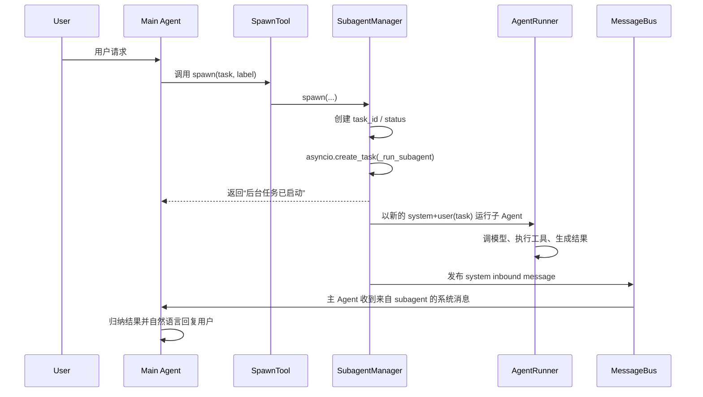

# nanobot Subagent 详解

本文档面向想要深入理解 `nanobot` 子 Agent 机制的开发者，重点解释：

1. `subagent` 在项目中的定位
2. 它和主 Agent 的关系
3. 它的完整执行链路
4. 它的工具、上下文、状态和回传机制
5. 它适合解决什么问题，不适合解决什么问题
6. 如果要把它用于复杂工作流编排，当前实现的边界在哪里

---

## 1. 概览

`nanobot` 的 `subagent` 是一个“后台子任务执行器”。

它不是一个独立部署的服务，也不是一个长期驻留的自治代理集群，而是由主 Agent 在运行过程中通过 `spawn` 工具临时创建出来的一个后台 LLM 执行单元。

它的核心目标是：

- 把复杂、耗时、可独立完成的任务从主对话线程里拆出去
- 让主 Agent 保持响应能力，不被长任务阻塞
- 在任务完成后，把结果重新汇报给主 Agent，再由主 Agent 用自然语言转述给用户

源码入口主要在：

- `nanobot/agent/subagent.py`
- `nanobot/agent/tools/spawn.py`
- `nanobot/templates/agent/subagent_system.md`
- `nanobot/templates/agent/subagent_announce.md`

---

## 2. 它在整体架构中的位置

主 Agent 的主循环在 `nanobot/agent/loop.py` 中。

在 `AgentLoop.__init__()` 里，系统会创建一个 `SubagentManager` 实例，并把它注册成 `spawn` 工具的后端：

- 主 Agent 负责接收用户消息、组装上下文、调用模型、执行工具
- `SubagentManager` 负责管理后台子任务
- `SpawnTool` 是主 Agent 暴露给模型的工具接口

也就是说：

`用户 -> 主 Agent -> spawn 工具 -> SubagentManager -> 后台 subagent`

对应代码：

- `nanobot/agent/loop.py`
- `nanobot/agent/tools/spawn.py`

---

## 3. Subagent 的本质

从实现上看，subagent 不是“线程池中的函数调用”，而是：

- 一个新的 `AgentRunner.run(...)` 调用
- 一套重新构造的工具注册表 `ToolRegistry`
- 一个更简化的 system prompt
- 一个新的消息起点：只有 system + user(task)

这意味着 subagent 和主 Agent 之间是“同一进程中的两个 LLM 执行上下文”，而不是共享一套对话状态继续跑。

这个设计带来两个非常重要的特点：

- 好处：上下文天然隔离，适合把长任务拆出去
- 代价：subagent 不会天然继承主 Agent 当前轮次里已经读过的大量细节，除非任务描述里明确要求它再次读取

---

## 4. 核心类与职责

### 4.1 `SubagentStatus`

`SubagentStatus` 是运行时状态对象，用来记录一个子任务当前的执行进展。

字段包括：

- `task_id`：短 ID
- `label`：展示给用户/日志看的标签
- `task_description`：原始任务文本
- `started_at`：启动时间
- `phase`：阶段
- `iteration`：当前迭代次数
- `tool_events`：工具调用事件摘要
- `usage`：token 使用情况
- `stop_reason`：停止原因
- `error`：错误信息

当前阶段值定义在代码注释里：

- `initializing`
- `awaiting_tools`
- `tools_completed`
- `final_response`
- `done`
- `error`

这部分实现位于：

- `nanobot/agent/subagent.py`

### 4.2 `_SubagentHook`

这是 subagent 专用的 hook，用来做两件事：

- 在工具执行前记录日志
- 在每轮迭代后，把迭代数、工具事件、usage、错误信息同步回 `SubagentStatus`

它不是业务逻辑调度器，而是运行期观测器。

### 4.3 `SubagentManager`

这是 subagent 体系的核心管理器，负责：

- 创建子任务
- 维护运行中的任务表
- 构造 subagent 的工具集和 prompt
- 启动后台执行
- 在完成后向主 Agent 回传结果
- 按 session 取消子任务
- 提供运行数量统计

---

## 5. `spawn` 工具是怎么接入的

主 Agent 并不是直接调用 `SubagentManager.spawn()`，而是通过工具系统暴露给模型。

`SpawnTool` 的接口很简单：

- 必填参数：`task`
- 可选参数：`label`

模型调用形态类似：

```json
{
  "task": "分析这个仓库的测试失败原因，并给出修复建议",
  "label": "测试分析"
}
```

`SpawnTool.execute()` 最终会调用：

`SubagentManager.spawn(task, label, origin_channel, origin_chat_id, session_key)`

这里的 `origin_channel`、`origin_chat_id`、`session_key` 非常关键，因为它们决定了任务完成后结果要回注到哪个会话里。

实现文件：

- `nanobot/agent/tools/spawn.py`

---

## 6. 完整执行链路

下面是 subagent 从创建到回传的大致时序。



拆开看有 6 步。

### 第 1 步：主 Agent 决定调用 `spawn`

这是一个模型决策行为，不是代码中预先写死的业务流程。

只要主 Agent 认为某个任务：

- 比较复杂
- 耗时较长
- 可以独立运行

它就可能调用 `spawn`。

### 第 2 步：`SubagentManager.spawn()` 创建任务

`spawn()` 会做这些事：

1. 生成一个短 `task_id`
2. 基于 `task` 生成 `display_label`
3. 创建一个 `SubagentStatus`
4. 用 `asyncio.create_task(...)` 启动 `_run_subagent(...)`
5. 把任务登记到：
   `self._running_tasks`
   `self._task_statuses`
   `self._session_tasks`
6. 注册 `done_callback`，用于结束后清理内存索引

返回值不是结果本身，而是一句确认信息，例如：

`Subagent [测试分析] started (id: ab12cd34). I'll notify you when it completes.`

### 第 3 步：`_run_subagent()` 构造子 Agent 运行环境

这里会重新构造一套工具集。

subagent 默认可用工具包括：

- `read_file`
- `write_file`
- `edit_file`
- `list_dir`
- `glob`
- `grep`
- `exec`
- `web_search`
- `web_fetch`

是否注册 `exec` 和 web 工具，仍取决于全局配置。

注意它的一个重要限制：

- 没有 `message`
- 没有 `spawn`
- 没有 `cron`

这意味着：

- subagent 不能直接给用户发消息
- subagent 不能再递归派生新的 subagent
- subagent 不能自己创建定时任务

这是一条非常明确的边界。

### 第 4 步：构造 subagent prompt

subagent 的 system prompt 来自：

- `nanobot/templates/agent/subagent_system.md`

它相比主 Agent 更简化，重点强调：

- 你是被主 Agent 派生出来完成特定任务的
- 你要聚焦当前任务
- 最终结果会被汇报回主 Agent

同时它也会注入：

- 运行时信息
- workspace 路径
- skills summary

但这里注入的是 skill 摘要，不是所有 skill 正文。

### 第 5 步：运行独立的 `AgentRunner`

subagent 最终调用：

`self.runner.run(AgentRunSpec(...))`

这里本质上和主 Agent 跑一轮工具代理一样，只是参数更收敛。

几个关键配置：

- `max_iterations=15`
- `fail_on_tool_error=True`
- `checkpoint_callback=_on_checkpoint`

其中：

- `max_iterations=15` 表示 subagent 默认比主 Agent 更收敛
- `fail_on_tool_error=True` 表示工具错误会导致这次子任务失败，而不是宽松继续
- `checkpoint_callback` 会把阶段和迭代状态回写给 `SubagentStatus`

### 第 6 步：结果通过消息总线回传主 Agent

当 subagent 成功或失败后，会调用 `_announce_result(...)`。

这一步不是直接回复用户，而是：

1. 使用模板 `agent/subagent_announce.md`
2. 生成一条系统消息
3. 通过 `MessageBus.publish_inbound(...)` 发布一条新的 `InboundMessage`

这条消息的关键特征是：

- `channel="system"`
- `sender_id="subagent"`
- `chat_id` 指向原对话

主 Agent 收到这条系统消息之后，会重新走一轮处理流程，把子任务结果归纳成对用户自然友好的语言。

模板中甚至明确写了：

`Summarize this naturally for the user. Keep it brief (1-2 sentences). Do not mention technical details like "subagent" or task IDs.`

所以设计目标非常清晰：

- 用户看到的是自然结果
- 不暴露内部调度细节

---

## 7. subagent 的上下文模型

subagent 不是继承主 Agent 当前全部对话上下文继续跑，它有自己的最小启动上下文。

它启动时的消息通常只有：

- system：subagent system prompt
- user：主 Agent 传入的 `task`

它不会自动拿到这些内容：

- 主 Agent 当前轮读过的所有文件全文
- 当前轮的全部 tool result
- 主 Agent 的完整推理轨迹
- 用户和主 Agent 在这一轮中的所有中间状态

它只拿到：

- workspace
- 一套可用工具
- 技能摘要
- 主 Agent 用 `task` 明确交给它的任务描述

这也是为什么如果你想让 subagent 稳定完成某一步，主 Agent 的 `task` 设计必须足够明确。

---

## 8. subagent 与 skills 的关系

subagent 也能看到 skills，但方式和主 Agent 类似：

- 注入 skill summary
- 需要时自己再 `read_file SKILL.md`

这意味着：

- subagent 可以独立决定使用哪个 skill
- subagent 可以再次读取 workspace skill 或 builtin skill
- 但它不会天然继承主 Agent 之前已经加载过的 skill 正文

对复杂多阶段工作流来说，这个特性非常重要，因为它提供了“阶段级上下文隔离”。

例如：

- 主 Agent 只负责总流程规划
- `cad` 阶段交给一个 subagent
- `mesh` 阶段交给另一个 subagent
- `postprocess` 阶段再交给第三个 subagent

这样每个 subagent 只需要关心自己的技能和局部上下文，不需要把所有 skill 全堆在一个大上下文里。

---

## 9. subagent 的工具边界

subagent 工具集被刻意限制过，这是架构上非常重要的一点。

### 9.1 它能做什么

- 读写工作区文件
- 搜索代码和目录
- 执行 shell 命令
- 访问网页
- 读取 skill 和参考文档

### 9.2 它不能做什么

- 不能直接发消息给用户
- 不能继续 `spawn`
- 不能直接创建 cron 任务

这会带来一个明显结果：

subagent 更像“后台执行 worker”，不是“有完整交互能力的第二个主 Agent”。

---

## 10. 状态可观测性

subagent 不是完全黑盒。

项目里已经提供了几种观测方式。

### 10.1 运行态状态结构

每个 subagent 都有 `SubagentStatus`，包含：

- 当前阶段 `phase`
- 当前迭代数 `iteration`
- 最近工具事件 `tool_events`
- token 使用量 `usage`
- 失败原因 `error`

### 10.2 `/status`

`/status` 会把当前 session 的活动任务数统计出来，其中包括 subagent。

实现上：

- 主任务数来自 `loop._active_tasks`
- subagent 数来自 `loop.subagents.get_running_count_by_session(ctx.key)`

### 10.3 `my(action="check", key="subagents")`

文档 `docs/MY_TOOL.md` 明确支持检查 subagent 状态。

能看到的信息包括：

- phase
- iteration
- elapsed
- tool events
- usage

这对于调试很有价值，特别是分析“为什么后台任务慢”或“卡在哪一步”时。

---

## 11. 生命周期管理

subagent 的生命周期是短暂的、任务式的。

### 11.1 创建

由 `spawn()` 创建并登记。

### 11.2 运行

由 `asyncio.create_task(...)` 在后台执行。

### 11.3 完成后清理

`done_callback` 会自动从这些索引中清理：

- `_running_tasks`
- `_task_statuses`
- `_session_tasks`

这说明 subagent 不是长期持久化实体，而是一次性后台任务。

### 11.4 被 `/stop` 取消

内置命令 `/stop` 不只取消主任务，也会调用：

`loop.subagents.cancel_by_session(msg.session_key)`

也就是说，`/stop` 会把当前 session 下的 subagent 一并取消。

这对交互体验很重要，因为用户通常期望“停止”是整轮任务都停，而不是只停主线程、后台还继续跑。

---

## 12. 错误处理策略

subagent 的错误处理偏严格。

因为它在 `AgentRunSpec` 中启用了：

- `fail_on_tool_error=True`

所以一旦工具报错，通常不会像主 Agent 某些场景那样宽松恢复，而是更容易直接进入失败分支。

失败后系统会：

1. 汇总最近成功的工具步骤
2. 找出最后的失败点
3. 生成一个简化的失败摘要
4. 通过 `_announce_result(..., status="error")` 回传主 Agent

这会让主 Agent 有机会把失败结果重新表达为对用户更友好的信息。

---

## 13. 为什么它适合做后台任务

subagent 的设计很适合下面几类任务：

- 仓库分析
- 测试排查
- 批量文件修改
- 长时间 shell 操作
- 独立的资料搜索
- 大任务拆分后的侧边工作

原因有三点。

### 13.1 不阻塞主对话线程

主 Agent 可以先回复“我已经开始处理，完成后通知你”，然后继续保持对当前会话的控制。

### 13.2 上下文隔离

子任务不会天然背负主 Agent 当前轮所有上下文污染。

### 13.3 结果回流自然

用户最终看到的是主 Agent 汇总后的自然语言，而不是裸露的任务日志。

---

## 14. 当前实现的边界与局限

这是理解 subagent 时最容易被误判的部分。

### 14.1 它不是多级递归调度器

因为 subagent 没有 `spawn` 工具，所以不能继续派生 subagent。

当前只支持：

- 主 Agent -> subagent

不支持：

- 主 Agent -> subagent A -> subagent B

### 14.2 它不是独立模型编排系统

`AgentLoop` 创建 `SubagentManager` 时直接传入 `model=self.model`。

这意味着 subagent 默认和主 Agent 使用同一个模型配置。

当前 `spawn` 工具接口也没有 `model` 参数。

所以它不是：

- 主 Agent 用大模型
- 子步骤自动切小模型

这种精细编排系统。

如果要支持这一点，需要扩展：

- `SpawnTool` 参数
- `SubagentManager.spawn()`
- `SubagentManager._run_subagent()`

### 14.3 它不是显式工作流引擎

当前 subagent 只负责“异步执行一个任务”。

它没有这些能力：

- DAG 调度
- 步骤依赖图
- 状态机式多阶段恢复
- 结构化产物传递协议
- 自动重试策略
- 多 worker 汇总器

所以如果你要做 CAE、EDA、数据流水线这类严格多阶段流程，subagent 可以作为底层执行单元，但还需要额外的 orchestration 层。

### 14.4 它的上下文仍可能膨胀

虽然 subagent 自己有独立上下文，但它内部仍然是一个普通 `AgentRunner`。

所以：

- 它读过的大文件也会进入自己的消息历史
- 它的工具结果也会经历截断、microcompact、history snip

也就是说，subagent 只是把上下文问题“拆分隔离”，不是让问题消失。

---

## 15. 对复杂工作流的启示

如果你要基于这个项目做复杂多阶段系统，一个比较合理的使用方式是：

### 方案 A：主 Agent 做规划，subagent 做执行

- 主 Agent 负责解析用户需求
- 主 Agent 负责决定要不要拆阶段
- 每个阶段由一个 subagent 完成
- 主 Agent 负责接收各阶段结果并决定下一步

这是当前实现最匹配的模式。

### 方案 B：把 subagent 当作“隔离上下文的 worker”

例如对 CAE：

- 主 Agent：只维护总流程、产物路径、阶段状态
- CAD subagent：只关注几何准备
- Mesh subagent：只关注网格生成
- Postprocess subagent：只关注结果提取和报告

这样做比“让一个 Agent 在一个长上下文中连续加载多个 skill”要稳。

### 不建议的方式

- 让一个总 skill 在单一长回合里不断加载大量子 skill 正文
- 指望 subagent 自己继续递归拆任务
- 指望当前实现自动完成工作流状态管理

---

## 16. 如果要增强 subagent，优先改哪里

如果你准备继续演进这个模块，我建议优先考虑下面几个方向。

### 16.1 支持 `spawn(model=...)`

用途：

- 主 Agent 用强模型做规划
- 子任务用便宜模型做执行

### 16.2 支持结构化结果协议

现在 subagent 回传的是自然语言结果摘要，更适合面向用户。

如果要做工程化工作流，通常还需要让 subagent 输出结构化结果，例如：

```json
{
  "status": "ok",
  "artifacts": ["mesh/result.msh"],
  "next_inputs": ["solver_config.json"],
  "summary": "网格已生成"
}
```

### 16.3 支持多阶段工作流状态

例如新增一个 orchestrator，显式记录：

- 当前阶段
- 输入产物
- 输出产物
- 失败原因
- 重试次数

### 16.4 支持更强的观测接口

例如增加：

- 单个 subagent 详情查询
- 最近 N 次工具调用详情
- 当前 prompt token 估算
- 最终结果与中间状态持久化

---

## 17. 关键源码索引

如果你想进一步读源码，建议按下面顺序看。

1. `nanobot/agent/tools/spawn.py`
2. `nanobot/agent/subagent.py`
3. `nanobot/agent/loop.py`
4. `nanobot/templates/agent/subagent_system.md`
5. `nanobot/templates/agent/subagent_announce.md`
6. `nanobot/command/builtin.py`
7. `docs/MY_TOOL.md`

---

## 18. 总结

一句话概括：

`nanobot` 的 subagent 是一个“由主 Agent 临时派生、在后台独立运行、完成后通过消息总线把结果送回主 Agent”的轻量级子任务执行机制。

它的优势在于：

- 简单
- 实用
- 上下文隔离
- 不阻塞主对话

它的边界在于：

- 没有递归派生
- 没有独立模型选择
- 没有显式工作流引擎
- 没有结构化阶段编排

所以它非常适合作为复杂系统中的“执行 worker 基元”，但如果你要做严格多阶段、强依赖、强状态管理的流程系统，仍需要在它之上再加一层 orchestration。
